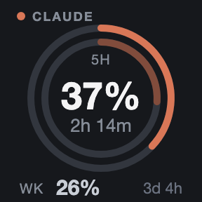
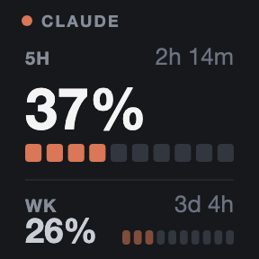
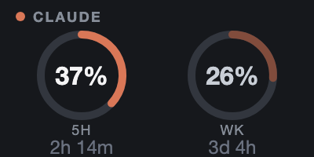
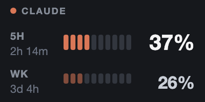

# C AI Usage

Shows the **5-hour and weekly usage windows** of a Claude or Codex subscription as gauges on Stream Deck + dials and keys.

The numbers are **account-wide values computed by the server** only — local usage logs (`~/.claude/projects/**/*.jsonl` and friends) are never read. If you use AI from more than one machine, one machine's log cannot add up to the account total.

## What it looks like

You can place it on a key or a dial, and each supports two charts: a **donut** and a **segment bar**. All four images use the same values (5-hour window 37%, weekly window 26%), so only the layout differs.

<table>
  <tr>
    <td></td>
    <th>Donut</th>
    <th>Segment bar</th>
  </tr>
  <tr>
    <th align="left">Key<br /><sub>144×144</sub></th>
    <td></td>
    <td></td>
  </tr>
  <tr>
    <th align="left">Dial<br /><sub>200×100</sub></th>
    <td></td>
    <td></td>
  </tr>
</table>

The dark background in these images is the **Stream Deck profile background** — the plugin does not paint its canvas ([known limitations](#known-limitations)).

## Requirements

|                 |                                                                                       |
| --------------- | ------------------------------------------------------------------------------------- |
| Stream Deck app | **7.1+** (manifest `SDKVersion: 3`)                                                   |
| Hardware        | Stream Deck + (dials) or any model with keys                                          |
| OS              | macOS 12+ / Windows 10+ (⚠ Windows is **implemented but unverified**)                 |
| Sign-in         | Claude needs **Claude Code**, Codex needs the **Codex CLI**, logged in on this device |

No native binary dependencies. The Stream Deck app bundles the Node runtime, so your local Node version does not matter.

## Language

Korean and English, chosen from the Stream Deck app language: Korean when the app is set to Korean, English for every other language. It is not a plugin setting.

## Install

This is a local install, not a Marketplace plugin.

```bash
npm install                              # once, from the repository root
npm run build -w c-ai-usage

cd c_ai_usage
npx streamdeck dev                                     # allow unsigned local plugins — once
npx streamdeck link com.sonky.c-ai-usage.sdPlugin      # link it into Stream Deck — once
```

A **C AI Usage** category appears in the Stream Deck action list with two actions, `Claude Usage` and `Codex Usage`, that you can drop onto a dial or a key.

For a distributable package: `npx streamdeck pack com.sonky.c-ai-usage.sdPlugin`.

## Controls

| Input                  | Action                                                                                     |
| ---------------------- | ------------------------------------------------------------------------------------------ |
| Key press              | Cycle the chart (donut ↔ bar)                                                              |
| Dial rotate            | Move one chart in the **direction** of the turn. It wraps, so turning on keeps it changing |
| Dial press · touch tap | Switch the basis (used ↔ remaining)                                                        |

Rotation is rate-limited by a 400 ms leading-edge throttle, so one flick moves exactly one step. On a key the press is already taken by the chart, so switch the basis in the Property Inspector.

## Settings

**Per instance** (separate for each action):

- Chart — donut / bar
- Basis — used / remaining
- Warn at — 50 · 60 · 70 · 75 · 80 · 85 · 90% (default 80)
- Critical at — 80 · 85 · 90 · 95 · 99 · 100% (default 95)

The two thresholds do not know about each other, so you can pick a warn threshold above the critical one. When you do, **it is pulled down to the critical value and the amber step disappears** (ok jumps straight to red).

**Global** (shared by both providers):

- Refresh — 1 · 3 · 5 · 10 · 30 · 60 min (default 5 min). This is a shared per-provider resource; per-instance intervals would multiply the request rate by the number of instances.

## Reading the screen

Two equally sized numbers on a narrow canvas (dial 200×100, key 144×144) means neither is readable at arm's length, so the gauges are drawn as **one lead plus one supporting** value. The exception is the **dial donut**, which has width to spare: two rings of the same size sit side by side and the hierarchy is carried by color alone.

- **No canvas fill** — the Stream Deck profile background shows through. In exchange, a dark background is **assumed** (see limitations).
- **Color means risk.** At or above the warn threshold amber, at or above the critical threshold red (80% and 95% by default, changeable per action). On the remaining basis the thresholds flip — 80% used and 20% left are the same situation, so they get the same color.
- **Time until reset** is shown per window — `2h 14m` for 5H, `3d 4h` for weekly.
- **`—` means "unknown", not 0%.** A window whose value is unknown gets only its track drawn.
- **If 5H is unknown and only weekly is known, weekly is promoted to the lead position.** Codex has returned only the weekly window since 2026-07-13, so **an empty 5H slot on Codex is normal** and that slot reads `Weekly only`.
- **On failure no gauge is drawn at all.** "Plenty left" and "the plugin is broken" must not look alike, so only a status title and a one-line next step appear — 10 distinct pairs such as `Sign-in needed` / `Log in: Claude Code`.
- **429 and network failures do not blank the screen.** The last successful value stays up with its age (`23m ago`), because both the credentials and the endpoint are fine.

## Network and credentials

Read from:

- The macOS keychain entry `Claude Code-credentials` (`security find-generic-password`) or `~/.claude/.credentials.json` — `CLAUDE_CONFIG_DIR` is honored
- `~/.codex/auth.json`

Called:

- `https://api.anthropic.com/api/oauth/usage`
- `https://chatgpt.com/backend-api/wham/usage`

Never done:

- **No token refresh.** The refresh token rotates as a one-time value, so refreshing here would leave the Claude Code CLI holding an invalid token and log it out. On expiry the plugin shows `Token expired`, and once the CLI refreshes on its next run the plugin recovers on the following poll.
- **No token in any settings store.** Action settings are plaintext and are included in Stream Deck profile exports.
- **No response bodies in the log.** Codex usage responses carry `email`, `user_id` and `account_id` in the clear.
- **No path where failure raises the request rate.** A failed poll always waits at least the poll interval, and from the fourth consecutive failure it moves to a fixed cooldown.

### statusline hook (optional)

Hands over usage that Claude Code already fetched, as a cache — **zero Claude API calls while you are coding**. Without it the plugin simply polls directly.

`~/.claude/settings.json`:

```json
{
  "statusLine": {
    "type": "command",
    "command": "node /absolute/path/c_ai_usage/scripts/statusline-cache.mjs"
  }
}
```

## Development

From the repository root:

```bash
npm test                      # one root vitest run covers every workspace
npm run lint
npm run build -w c-ai-usage
npm run watch -w c-ai-usage   # rebuild on change plus an automatic streamdeck restart on save
```

From this directory:

```bash
npx streamdeck validate com.sonky.c-ai-usage.sdPlugin
node scripts/build-icons.mjs         # regenerate the 16 icons (needs headless Chrome)
node scripts/build-readme-shots.mjs  # regenerate the 4 README screenshots (run npm test first)
```

**When you change the renderer, rebake the README screenshots** — `docs/*.png` are committed build products and nothing signals when they go stale. Their input is the `preview/*.svg` that `npm test` writes, hence the order. The preview holds a `ko-` and an `en-` set; the screenshots use the `en-` one because this README is English.

There is no separate typecheck script — `npm run build` covers it through rollup's `@rollup/plugin-typescript`.

The gauge is SVG generated in-plugin by a pure function (`src/render/gauge.ts`), so fixtures alone cover every state. `npm test` also writes the `preview/index.html` contact sheet, which tiles every combination at canvas size and is **for judging layout**. It does not surface the real on-device size (keys scale down to the SD+ HID resolution of 120×120) or rasterizer feature gaps; for those, bake the SVGs from `preview/` at real size with headless Chrome, or look at the device.

## Known limitations

- **Windows is implemented but unverified.** With no native dependencies, the risk is limited to the credential paths.
- **Unreadable on a light profile background.** Because the gauge does not paint a background, the readout numbers (light gray), the supporting ring and the rules are all lost on a light background; only the threshold colors (amber, red) survive. Keep the Stream Deck profile background dark.
- **Time until reset is only as accurate as the poll interval.** Polling is the sole trigger for a redraw, so the countdown can be stale by up to one interval (5 min by default). Shorten the refresh interval if that bothers you.
- **Codex returns only the weekly window.** If the vendor starts returning a 5-hour window again it fills in with no code change (windows are assigned by duration bucket).
- Custom titles are unavailable on keys (`UserTitleEnabled: false`) — this removes the trap where a user-set title permanently suppresses the plugin's own output.

## Documents

Written in Korean.

|                              |                                                       |
| ---------------------------- | ----------------------------------------------------- |
| [SPEC.md](SPEC.md)           | Contracts and business rules (SSOT)                   |
| [DECISIONS.md](DECISIONS.md) | Design decisions, their reasons, alternatives weighed |
| [../CLAUDE.md](../CLAUDE.md) | The couplings to know before touching code            |
