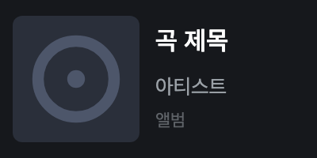

# Media Controller

Shows and controls the current track on a Stream Deck + through the **OS media session**. It is not tied to a particular app, so every player works — including YouTube Music, browser PWA and all.

## What it looks like



The touch strip (200×100) holds the album art plus track title, artist and album on three lines. On a key the album art becomes the key image and the track title becomes the title. The dark background is the Stream Deck profile background — the layout has no background item.

⚠ **This image is a reconstruction, not a device capture.** The plugin only sends values through `setFeedback`; the device's layout renderer draws them, so there is no render output to capture. The image is redrawn straight from the rect, font size, weight and color in the [layout definition](com.sonky.media-controller.sdPlugin/layouts/now-playing.json); the device's font family and antialiasing are not reproduced. The track text is a placeholder.

## Requirements

|                 |                                                                                                  |
| --------------- | ------------------------------------------------------------------------------------------------ |
| Stream Deck app | **7.1+** (manifest `SDKVersion: 3`)                                                              |
| Hardware        | Stream Deck + (dials) or any model with keys                                                     |
| OS              | macOS 12+. The manifest declares macOS only — the Windows bridge is written but ⚠ **unverified** |

The Stream Deck app bundles the Node runtime, so your local Node version does not matter.

## Language

Korean and English, chosen from the Stream Deck app language: Korean when the app is set to Korean, English for every other language. It is not a plugin setting.

## Install

This is a local install, not a Marketplace plugin.

```bash
npm install                                  # once, from the repository root
npm run build -w media-controller

cd media_controller
npx streamdeck dev                                         # allow unsigned local plugins — once
npx streamdeck link com.sonky.media-controller.sdPlugin    # link it into Stream Deck — once
```

A **Media Controller** category appears in the Stream Deck app with three actions to place.

On macOS the vendored bridge is committed with the repository, so nothing else to build. **Windows is written but not declared in the manifest**, so the plugin does not install there — see [Media backends](#media-backends) below.

For a distributable package: `npx streamdeck pack com.sonky.media-controller.sdPlugin`.

## Actions and controls

| Action          | Surface    | Input                                                         |
| --------------- | ---------- | ------------------------------------------------------------- |
| **Now Playing** | dial · key | Shows the track                                               |
|                 | dial       | rotate → next/previous track, press or touch tap → play/pause |
|                 | key        | press → play/pause                                            |
| **Next Track**  | key        | press → next track                                            |
| **Previous**    | key        | press → previous track                                        |

A key has only one gesture, so Next and Previous are split out as their own actions to stand in for rotation. One dial covers all three inputs; on a key-only device the same feature set is **Now Playing + Next + Previous**.

Control commands go to the OS's "current now-playing session" — there is no way to target a specific app.

## Screen

- **Dial**: album art plus title, artist and album on the touch strip
- **Key**: album art as the key image, track title as the title

It refreshes every second, but that only reads a value the bridge has already cached, so it is cheap (track changes are pushed by the bridge). A render identical to the previous one is skipped, to avoid re-sending the album-art base64.

**With nothing playing** it shows `Nothing playing`; **when the bridge fails permanently** it shows `Setup needed`. The Next and Previous keys flash an exclamation mark (`showAlert`) when a control command fails.

The play/pause state icon does not toggle (single State) — the same intentional limitation as on the dial.

## Media backends

**Since macOS 15.4, calling `MRMediaRemoteGetNowPlayingInfo` from inside an app returns nil** — track info is blocked (control commands still work). Track info therefore has to come from an out-of-process bridge. Windows uses a helper process for a related reason: the bundled Node 24 plus fragile native addons.

Both platform bridges have the **same shape**: a persistent stream process emits state as line-delimited JSON and the plugin caches it, while control is a one-shot `send`. If the stream dies it restarts on the next poll, but three consecutive immediate exits disable the bridge permanently (this blocks a restart-per-second loop).

### macOS — vendored, verified

Vendors [`ungive/mediaremote-adapter`](https://github.com/ungive/mediaremote-adapter) v0.7.6. `/usr/bin/perl` holds the entitlement to use MediaRemote, and the helper framework that perl loads dynamically writes track info to stdout — that is the path around the 15.4+ restriction.

The perl script and `MediaRemoteAdapter.framework` (universal, ad-hoc signed) are **not gitignored and are committed** (self-contained distribution). To rebuild the framework:

```bash
./scripts/build-mediaremote-adapter.sh          # defaults to v0.7.6
./scripts/build-mediaremote-adapter.sh v0.7.6   # a specific tag
```

It compiles a universal binary with clang, ad-hoc signs it, places it in `vendor/` and verifies it with `get` (no cmake needed). Because the signature is ad-hoc, it must survive the copy for the framework to load.

The framework layout is **flat on purpose** — no `Versions/A`, no symlinks. `streamdeck pack` leaves the framework's top-level `MediaRemoteAdapter` symlink out of the archive, and that is the path the perl script loads, so a packaged plugin would report `Setup needed` even though a `streamdeck link`ed working tree runs fine. After changing anything under `vendor/`, verify the **packaged** copy, not just the linked one:

```bash
npx streamdeck pack com.sonky.media-controller.sdPlugin -o /tmp/pack -f
unzip -q /tmp/pack/com.sonky.media-controller.streamDeckPlugin -d /tmp/unpacked
V=/tmp/unpacked/com.sonky.media-controller.sdPlugin/vendor/mediaremote-adapter
/usr/bin/perl "$V/mediaremote-adapter.pl" "$V/MediaRemoteAdapter.framework" get   # exit 0
```

### Windows — implemented, unverified, not declared

Shells out to a vendored `smtc-helper` (.NET, `Windows.Media.Control`) to read track info and send control commands through SMTC. The source is in [`smtc-helper/`](smtc-helper/) but **the exe is not committed** — build it on Windows with the .NET 8 SDK. The manifest's `OS` list deliberately omits Windows so the plugin is not offered on a platform nobody has run it on.

```powershell
pwsh scripts/build-smtc-helper.ps1                 # framework-dependent (small, needs the .NET runtime)
pwsh scripts/build-smtc-helper.ps1 -SelfContained  # self-contained (no runtime needed, large)
```

This repository was written on macOS. The code and structure follow the same pattern as the macOS side, but **verifying it on a real machine is still outstanding.**

## Development

From the repository root:

```bash
npm run lint
npm run build -w media-controller
npm run watch -w media-controller   # rebuild on change plus an automatic streamdeck restart on save
```

From this directory:

```bash
npx streamdeck validate com.sonky.media-controller.sdPlugin
npx streamdeck restart com.sonky.media-controller
node scripts/build-readme-shots.mjs   # regenerate the image above (needs headless Chrome)
node scripts/build-store-shots.mjs    # Marketplace assets → store/ (gallery 1920×960 plus a 288×288 app icon, gitignored)
```

**When you change the layout, rebake the image** — `docs/dial.png` is a committed build product and nothing signals when it goes stale. The script reads the layout JSON, so there are no coordinates to keep in sync by hand.

There is no separate typecheck script — `npm run build` covers it through rollup's `@rollup/plugin-typescript`.

**Debugging**: add `"Debug": "enabled"` under `Nodejs` in the manifest (it is off right now, for distribution) and attach with the VS Code [Attach to Plugin](.vscode/launch.json) configuration.

This workspace has no unit tests (`npm test` runs from the root but finds nothing to pick up here). Verification was done against a real device media session. Parsing the bridge JSON is the point that fixtures could cover, so there is room to add tests.

## Known limitations

- **Windows is implemented but unverified, so the manifest declares macOS only** — the plugin does not install on Windows. Once verified, `smtc-helper.exe` gets committed, the `windows` entry returns to the manifest and this note goes away.
- **You cannot choose which app to control** — commands go to the OS's current session.
- **The play/pause state is not toggled as an icon** (single State, no `setState`).
- Framework **notarization** is worth revisiting before wider distribution. Ad-hoc signing is enough for your own machine and for development, but Gatekeeper may object elsewhere.

## Third party

|                                                                                      |                                                                                                                                                                                              |
| ------------------------------------------------------------------------------------ | -------------------------------------------------------------------------------------------------------------------------------------------------------------------------------------------- |
| [`ungive/mediaremote-adapter`](https://github.com/ungive/mediaremote-adapter) v0.7.6 | BSD 3-Clause — © 2025 Jonas van den Berg and contributors. Full license text at [vendor/mediaremote-adapter/LICENSE](com.sonky.media-controller.sdPlugin/vendor/mediaremote-adapter/LICENSE) |

## Documents

Written in Korean.

|                              |                                                       |
| ---------------------------- | ----------------------------------------------------- |
| [SPEC.md](SPEC.md)           | Contracts and business rules (SSOT)                   |
| [DECISIONS.md](DECISIONS.md) | Design decisions, their reasons, alternatives weighed |
| [../CLAUDE.md](../CLAUDE.md) | The couplings to know before touching code            |
